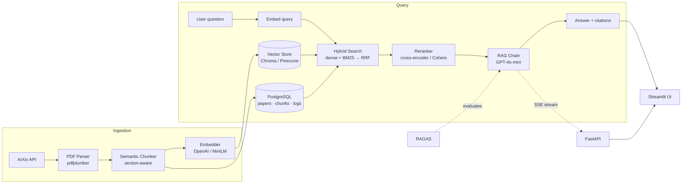

# 📚 ArXiv Research Assistant

> Production-grade **RAG chatbot** that answers questions about ArXiv machine-learning papers with **cited sources** — hybrid retrieval, cross-encoder reranking, streaming answers, and RAGAS evaluation.


**🔗 Live demo:** _add your deployment URL here_

---

## Overview

An end-to-end Retrieval-Augmented Generation (RAG) system over ArXiv machine-learning
papers, developed as an academic project. It covers the full lifecycle of a modern
retrieval system: data ingestion from the ArXiv API, section-aware document chunking,
dense and sparse indexing, hybrid retrieval with reranking, grounded answer generation
with source citations, and quantitative evaluation with RAGAS. The system is packaged
with a REST API, a web interface, containerized services, continuous integration, and a
reproducible deployment path.

## Key features

- **Hybrid retrieval** — dense embeddings combined with BM25, fused via Reciprocal Rank Fusion (RRF).
- **Cross-encoder reranking** — `ms-marco-MiniLM` (or Cohere) performs second-stage relevance scoring.
- **Section-aware chunking** — chunks never span section boundaries (`Abstract` / `Introduction` / `Results`), are sentence-aligned, and respect token budgets.
- **Streaming API** — answers are streamed token-by-token over Server-Sent Events, followed by a structured `sources` event.
- **Evaluation** — RAGAS metrics: faithfulness, answer relevancy, context recall, and context precision.
- **Pluggable, cost-free backends** — local `sentence-transformers`, a local cross-encoder, and Chroma require no API keys; Groq supplies a free hosted LLM. OpenAI, Cohere, and Pinecone are optional drop-in alternatives selected via environment variables.

---

## 🏗️ Architecture



---

## 📊 Evaluation (RAGAS-style, LLM-as-judge)

The system is evaluated on a 20-question hand-crafted test set
([`src/evaluation/test_set.py`](src/evaluation/test_set.py)) using the four RAGAS metric
definitions. Because the RAGAS library is incompatible with LangChain 1.x, the metrics are
computed by a self-contained **LLM-as-judge** evaluator
([`src/evaluation/judge.py`](src/evaluation/judge.py)) that uses the same free **Groq** model
as the judge and the local **MiniLM** model for the embedding-based relevancy metric — so
evaluation runs at zero cost. Regenerate with `python -m scripts.evaluate`.

| Metric            | Score |
| ----------------- | ----- |
| Faithfulness      | 0.601 |
| Answer Relevancy  | 0.574 |
| Context Recall    | 0.722 |
| Context Precision | 0.766 |

> Run over a 20-paper `cs.LG` corpus (1,263 chunks) using a **corpus-grounded** test set
> generated from the indexed papers (`scripts/generate_testset.py`). Judge: Groq
> `llama-3.1-8b-instant`; relevancy uses local MiniLM embeddings. High context
> recall/precision indicate retrieval surfaces the right passages; faithfulness reflects a
> deliberately strict claim-by-claim judge. Reproduce with `python -m scripts.evaluate`.

---

## 🎬 Demo


> Record this GIF once the app is running with [`scripts/record_demo.md`](docs/record_demo.md)
> (asking a question → streamed answer → expanding the source cards), then save it to
> `docs/demo.gif`.

---

## 🚀 Quick start

```bash
git clone <your-repo-url> arxiv-rag
cd arxiv-rag
cp .env.example .env          # defaults run fully local & free
docker compose up --build     # postgres + api (8000) + frontend (8501)
```

Then, in another terminal, ingest some papers:

```bash
# inside the api container (or a local venv)
python -m scripts.ingest --max-papers 50
```

Open:
- **Frontend:** http://localhost:8501
- **API docs:** http://localhost:8000/docs
- **Health:** http://localhost:8000/health

### Local dev without Docker

```bash
python -m venv .venv && source .venv/bin/activate   # Windows: .venv\Scripts\Activate.ps1
pip install -r requirements.txt
# Start Postgres (or set POSTGRES_URL to a sqlite URL for a quick spin)
uvicorn src.api.main:app --reload          # API
streamlit run src/frontend/app.py          # UI (separate terminal)
```

---

## ☁️ Production deployment (Azure VM + HTTPS + auto-deploy)

A full production stack ships in this repo: an **nginx** reverse proxy, **Let's Encrypt**
HTTPS via **certbot**, and a **GitHub Actions** workflow that auto-deploys to the server on
every push to `main`. It targets an **Azure virtual machine** (Ubuntu), which works well with
the **Azure for Students** credit included in the GitHub Student Developer Pack.

```bash
# on a fresh Ubuntu Azure VM
curl -fsSL <repo>/raw/main/scripts/deploy/vm-bootstrap.sh | bash
cd ~/arxiv-rag && cp .env.example .env && nano .env   # set DOMAIN, CERTBOT_EMAIL, secrets
bash scripts/deploy/init-letsencrypt.sh               # one-time TLS cert
docker compose -f docker-compose.prod.yml up -d --build
```

📋 **Full step-by-step runbook:** [DEPLOYMENT.md](DEPLOYMENT.md) — covers creating the VM,
network security group rules, a static public IP, DNS, certbot, server-side secrets, and
wiring up the auto-deploy workflow.

| Production component            | File |
| ------------------------------- | ---- |
| Compose: pg + api + frontend + nginx + certbot | [docker-compose.prod.yml](docker-compose.prod.yml) |
| Reverse proxy (SSE + websockets) | [nginx/app.conf.template](nginx/app.conf.template) |
| VM bootstrap (Docker + firewall) | [scripts/deploy/vm-bootstrap.sh](scripts/deploy/vm-bootstrap.sh) |
| TLS certificate bootstrap       | [scripts/deploy/init-letsencrypt.sh](scripts/deploy/init-letsencrypt.sh) |
| Auto-deploy on push to main     | [.github/workflows/deploy.yml](.github/workflows/deploy.yml) |

---

## 📦 Dataset

- **Source:** ArXiv API, category `cs.LG` (configurable).
- **Window:** 2023-01-01 → 2024-12-31 (`ARXIV_START_DATE` / `ARXIV_END_DATE`).
- **Volume:** up to `MAX_PAPERS` (default 500).
- **Re-run ingestion:** `python -m scripts.ingest --max-papers 500 --category cs.LG`.
  Metadata is written to Postgres **before** PDFs download, so interrupted runs resume cleanly.

---

## 🧩 Configuration

All behaviour is controlled by `.env` (see [`.env.example`](.env.example)):

| Variable            | Options                            | Default  |
| ------------------- | ---------------------------------- | -------- |
| `EMBEDDING_BACKEND` | `local` · `openai`                 | `local`  |
| `VECTOR_BACKEND`    | `chroma` · `pinecone`              | `chroma` |
| `RERANKER_BACKEND`  | `local` · `cohere`                 | `local`  |
| `LLM_BACKEND`       | `groq` · `openai` · `echo`         | `groq`   |

> **Fully free path:** `LLM_BACKEND=groq` (Llama 3.3 70B on Groq's free, no-credit-card,
> OpenAI-compatible API) + `EMBEDDING_BACKEND=local` + `RERANKER_BACKEND=local` +
> `VECTOR_BACKEND=chroma`. Get a key at [console.groq.com/keys](https://console.groq.com/keys).
> RAGAS then uses Groq as the judge with local embeddings — **evaluation is free too**.
> `LLM_BACKEND=echo` needs no key at all (used in tests/CI).

---

## 🛠️ Tech stack

Python 3.11 · arxiv · pdfplumber · tiktoken · spaCy · sentence-transformers · Chroma · Pinecone ·
rank-bm25 · Cohere / cross-encoder · LangChain · GPT-4o-mini · FastAPI · Streamlit · SQLAlchemy ·
PostgreSQL · RAGAS · MLflow · Docker · GitHub Actions.

---

## 🧪 Tests & quality

```bash
pytest tests/ -v --cov=src      # unit tests (mocked LLM + vector store)
ruff check src/ tests/          # lint
mypy src/                       # type-check
```

---

## 📁 Project layout

```
src/
  ingestion/   arxiv_client · pdf_parser · chunker
  embeddings/  embedder · vector_store (Chroma + Pinecone)
  retrieval/   hybrid_search (RRF) · reranker
  generation/  chain · prompts · llm
  db/          models · session · repository
  evaluation/  test_set · ragas_eval
  api/         main · routes/ · schemas
  frontend/    app.py (Streamlit)
scripts/       ingest.py · evaluate.py
tests/         chunker · hybrid_search · reranker · api
```

---

## 📄 License

MIT
