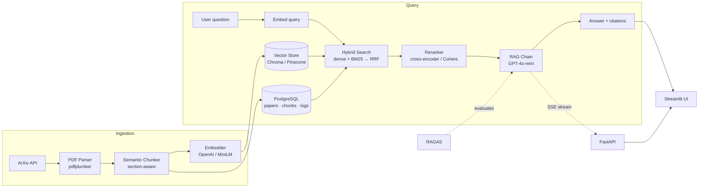

# 📚 ArXiv Research Assistant

> Production-grade **RAG chatbot** that answers questions about ArXiv machine-learning papers with **cited sources** — hybrid retrieval, cross-encoder reranking, streaming answers, and RAGAS evaluation.


**🔗 Live demo:** _add your deployment URL here_

---

## ✨ Why this is more than a tutorial

- **True hybrid search** — dense embeddings **+** BM25, fused with **Reciprocal Rank Fusion** (not just cosine similarity).
- **Cross-encoder reranking** — `ms-marco-MiniLM` (or Cohere) re-scores candidates the way production systems do.
- **Section-aware chunking** — never splits across `Abstract / Introduction / Results`, sentence-aligned with token budgets.
- **Streaming API** — Server-Sent Events stream tokens, then a final `sources` event.
- **RAGAS scores** — faithfulness / relevancy / recall / precision, gated in CI.
- **Runs free out of the box** — local `sentence-transformers`, local cross-encoder, and Chroma require **no API keys**; swap to OpenAI / Cohere / Pinecone via env vars.

---

## 🏗️ Architecture



---

## 📊 RAGAS evaluation

Run `python -m scripts.evaluate` to regenerate. Scores are computed over the 20-question
hand-crafted test set in [`src/evaluation/test_set.py`](src/evaluation/test_set.py).

| Metric            | Score |
| ----------------- | ----- |
| Faithfulness      | _TBD_ |
| Answer Relevancy  | _TBD_ |
| Context Recall    | _TBD_ |
| Context Precision | _TBD_ |

> Replace _TBD_ with the values printed by `scripts/evaluate.py` after ingesting papers and running with an OpenAI key. CI fails if faithfulness drops below **0.70**.

---

## 🎬 Demo


> Record this GIF once the app is running with [`scripts/record_demo.md`](docs/record_demo.md)
> (asking a question → streamed answer → expanding the source cards), then save it to
> `docs/demo.gif`.

---

## 🚀 Quick start

```bash
git clone <your-repo-url> arxiv-rag
cd arxiv-rag
cp .env.example .env          # defaults run fully local & free
docker compose up --build     # postgres + api (8000) + frontend (8501)
```

Then, in another terminal, ingest some papers:

```bash
# inside the api container (or a local venv)
python -m scripts.ingest --max-papers 50
```

Open:
- **Frontend:** http://localhost:8501
- **API docs:** http://localhost:8000/docs
- **Health:** http://localhost:8000/health

### Local dev without Docker

```bash
python -m venv .venv && source .venv/bin/activate   # Windows: .venv\Scripts\Activate.ps1
pip install -r requirements.txt
# Start Postgres (or set POSTGRES_URL to a sqlite URL for a quick spin)
uvicorn src.api.main:app --reload          # API
streamlit run src/frontend/app.py          # UI (separate terminal)
```

---

## ☁️ Production deployment (AWS EC2 + HTTPS + auto-deploy)

A full production stack ships in this repo: **nginx** reverse proxy, **Let's Encrypt**
HTTPS via **certbot**, and **GitHub Actions** that auto-deploy to EC2 on every push to `main`.

```bash
# on a fresh Ubuntu EC2 instance
curl -fsSL <repo>/raw/main/scripts/deploy/ec2-bootstrap.sh | bash
cd ~/arxiv-rag && cp .env.example .env && nano .env   # set DOMAIN, CERTBOT_EMAIL, secrets
bash scripts/deploy/init-letsencrypt.sh               # one-time TLS cert
docker compose -f docker-compose.prod.yml up -d --build
```

📋 **Full step-by-step runbook:** [DEPLOYMENT.md](DEPLOYMENT.md) — covers launching the
instance, the security-group rules, an **Elastic IP**, DNS, certbot, server-side secrets,
and wiring up the auto-deploy workflow. GCP Cloud Run notes are included too.

| Production piece              | File |
| ----------------------------- | ---- |
| Compose: pg+api+frontend+nginx+certbot | [docker-compose.prod.yml](docker-compose.prod.yml) |
| Reverse proxy (SSE + websockets) | [nginx/app.conf.template](nginx/app.conf.template) |
| EC2 bootstrap (Docker + firewall) | [scripts/deploy/ec2-bootstrap.sh](scripts/deploy/ec2-bootstrap.sh) |
| TLS certificate bootstrap     | [scripts/deploy/init-letsencrypt.sh](scripts/deploy/init-letsencrypt.sh) |
| Auto-deploy on push to main   | [.github/workflows/deploy.yml](.github/workflows/deploy.yml) |

---

## 📦 Dataset

- **Source:** ArXiv API, category `cs.LG` (configurable).
- **Window:** 2023-01-01 → 2024-12-31 (`ARXIV_START_DATE` / `ARXIV_END_DATE`).
- **Volume:** up to `MAX_PAPERS` (default 500).
- **Re-run ingestion:** `python -m scripts.ingest --max-papers 500 --category cs.LG`.
  Metadata is written to Postgres **before** PDFs download, so interrupted runs resume cleanly.

---

## 🧩 Configuration

All behaviour is controlled by `.env` (see [`.env.example`](.env.example)):

| Variable            | Options                       | Default  |
| ------------------- | ----------------------------- | -------- |
| `EMBEDDING_BACKEND` | `local` · `openai`            | `local`  |
| `VECTOR_BACKEND`    | `chroma` · `pinecone`         | `chroma` |
| `RERANKER_BACKEND`  | `local` · `cohere`            | `local`  |
| `LLM_BACKEND`       | `openai` · `echo` (offline)   | `openai` |

> Set `LLM_BACKEND=echo` to exercise the full pipeline with **no OpenAI key** (used in tests/CI).

---

## 🛠️ Tech stack

Python 3.11 · arxiv · pdfplumber · tiktoken · spaCy · sentence-transformers · Chroma · Pinecone ·
rank-bm25 · Cohere / cross-encoder · LangChain · GPT-4o-mini · FastAPI · Streamlit · SQLAlchemy ·
PostgreSQL · RAGAS · MLflow · Docker · GitHub Actions.

---

## 🧪 Tests & quality

```bash
pytest tests/ -v --cov=src      # unit tests (mocked LLM + vector store)
ruff check src/ tests/          # lint
mypy src/                       # type-check
```

---

## 📁 Project layout

```
src/
  ingestion/   arxiv_client · pdf_parser · chunker
  embeddings/  embedder · vector_store (Chroma + Pinecone)
  retrieval/   hybrid_search (RRF) · reranker
  generation/  chain · prompts · llm
  db/          models · session · repository
  evaluation/  test_set · ragas_eval
  api/         main · routes/ · schemas
  frontend/    app.py (Streamlit)
scripts/       ingest.py · evaluate.py
tests/         chunker · hybrid_search · reranker · api
```

---

## 📄 License

MIT
